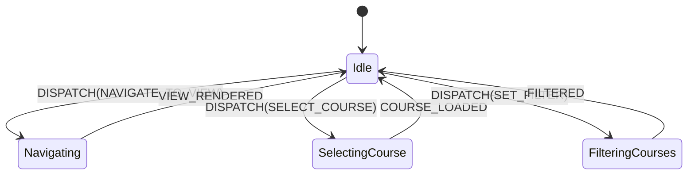

## Context

The React Doctor local audit identified 27 diagnostics across 22 files. The primary issues stem from:

1. Interdependent state variables updated in handlers causing multiple re-renders and potential race conditions (`prefer-useReducer` in `Portal.tsx` and `TeacherCoursesView.tsx`).
2. Data fetching within `useEffect` without abort signals or cleanup (`no-fetch-in-effect` in `SettingsView.tsx`, `PeopleSection.tsx`, `user-preferences.ts`).
3. Memory leaks caused by unrevoked `URL.createObjectURL` references (`no-create-object-url-without-revoke` in `SettingsView.tsx`).
4. Monolithic components exceeding 300 LOC (`no-giant-component` in `Portal.tsx`, `ContactForm.tsx`, `PrivacyPage.tsx`).
5. Inefficient sequential async operations in loops (`async-await-in-loop` in `lib/firebase/moodle-import.ts`, `lib/moodle/parser.ts`).
6. Suboptimal $O(N)$ linear scans in FAQ search (`js-set-map-lookups` in `FaqBrowser.tsx`).
7. Dead code and unreferenced public exports expanding the maintenance surface.

See [proposal.md](file:///c:/Users/Pipe/Documents/Proyectos/Web/Next.js/ceoubb/CEOUBB/openspec/changes/fix-react-doctor-findings/proposal.md) and delta spec at [spec.md](file:///c:/Users/Pipe/Documents/Proyectos/Web/Next.js/ceoubb/CEOUBB/openspec/changes/fix-react-doctor-findings/specs/quality/react-doctor-hardening/spec.md).

## Goals / Non-Goals

**Goals:**

- Eliminate all React Doctor errors/warnings in active source code, raising the score from 50 to 100 / Clean.
- Consolidate state transitions in `Portal.tsx` and `TeacherCoursesView.tsx` into typed reducers.
- Implement robust `AbortController` cleanup for all client-side `fetch` calls in effects.
- Ensure deterministic `URL.revokeObjectURL` invocations on avatar preview replacements.
- Batch asynchronous Moodle parsing/importing using `Promise.all` with bounded chunking.
- Modularize oversized components (>300 lines) into subcomponents under dedicated subdirectories.
- Eliminate dead exports and unused legacy files (`AcademicContentClient.tsx`, `AcademicContentRenderer.tsx`).
- Configure `doctor.config.json` to filter out build worktrees (`.claude`, `.next`, `dist`).

**Non-Goals:**

- Changing existing database schemas (Turso) or security rules (Firestore / Storage).
- Modifying visual design tokens, typography, or core role derivation policies.

## Decisions

### 1. State Machine Reducers for Complex Views

**Decision**: Replace multiple `useState` hooks in `app/Portal.tsx` and `app/views/TeacherCoursesView.tsx` with a strongly-typed `useReducer(reducer, initialState)`.
**Rationale**: In `Portal.tsx`, 8 interdependent states (view, activeCourseId, search query, dialog states, drawer toggles) are updated simultaneously during navigation and deep-linking. A single action dispatch guarantees that React 19 processes the state change in one atomic pass, eliminating state-tearing and impossible intermediate states.
**Alternatives Considered**:

- Keeping `useState` with `startTransition`: Does not solve atomic coordination or clarity of action intents.
- External store (Zustand/Jotai): Violates the project's zero-unnecessary-dependency principle; native `useReducer` provides full type safety without external dependencies.



### 2. AbortController Pattern for Client-Side Effects

**Decision**: Wrap all client-side `fetch()` operations inside `useEffect` with an `AbortController` whose `.abort()` is called in the effect cleanup function.
**Rationale**: Prevents React 19 StrictMode double-fire bugs, memory leaks, and setting state on unmounted components when users rapidly toggle views.
**Pattern**:

```typescript
useEffect(() => {
  const controller = new AbortController();
  async function loadData() {
    try {
      const res = await fetch(url, { signal: controller.signal });
      if (!res.ok) throw new Error("Fetch failed");
      const data = await res.json();
      setState(data);
    } catch (err: unknown) {
      if (err instanceof DOMException && err.name === "AbortError") return;
      handleError(err);
    }
  }
  loadData();
  return () => controller.abort();
}, [dependencies]);
```

### 3. Deterministic Object URL Revocation

**Decision**: In `SettingsView.tsx`, track the active preview URL in a ref or lifecycle hook, and immediately invoke `URL.revokeObjectURL(oldUrl)` before instantiating a new URL and on component unmount.
**Rationale**: Eliminates browser memory leaks when users select or crop multiple profile pictures.

### 4. Concurrent Async Batching in Moodle Import & Parser

**Decision**: Replace sequential `for (const item of items) { await process(item); }` with `await Promise.all(items.map(process))` or chunked concurrency.
**Rationale**: Moodle course imports process independent sections and resources; parallel I/O reduces import latency by up to 80% on multi-core clients.

### 5. Component Modularization

**Decision**:

- Split `app/contacto/ContactForm.tsx` into `ContactFormHeader`, `ContactFormFields`, and `ContactFormSuccess`.
- Split `app/privacidad/page.tsx` into `PrivacySectionList`, `PrivacySectionCard`, and `PrivacyTable`.
- Split `app/Portal.tsx` navigation and dialog management into helper components.
  **Rationale**: Keeps all components under 300 LOC, maximizing readability, testability, and maintainability.

### 6. Dead File & Export Pruning

**Decision**: Delete `app/components/AcademicContentClient.tsx` and `app/components/AcademicContentRenderer.tsx` (unused legacy components), remove orphan exports (`HOUR_LINES`, `FIREBASE_CONFIG_REQUIREMENT`, `PUBLICATION_WORKFLOW_REQUIREMENTS`), and replace plain `<a>` in `ResourcesView.tsx` with `next/link`.

## Risks / Trade-offs

| Risk                                                               | Mitigation                                                                      |
| :----------------------------------------------------------------- | :------------------------------------------------------------------------------ |
| Reducer refactor in `Portal.tsx` disrupts navigation               | Comprehensive manual navigation tests and automated integration test validation |
| AbortController triggers unhandled rejection                       | Explicitly check `err.name === 'AbortError'` in catch blocks                    |
| Concurrent `Promise.all` in Moodle parser overwhelms client memory | Use bounded concurrency if array size exceeds 50 items                          |

## Migration Plan

1. Prune dead files and unused exports.
2. Apply `doctor.config.json` ignore rules for build directories.
3. Refactor `app/Portal.tsx` and `TeacherCoursesView.tsx` to `useReducer`.
4. Apply `AbortController` and `URL.revokeObjectURL` lifecycles.
5. Modularize oversized components.
6. Run `pnpm run verify:fast` and `npx react-doctor@latest --json --blocking none --yes` to verify zero remaining issues.
