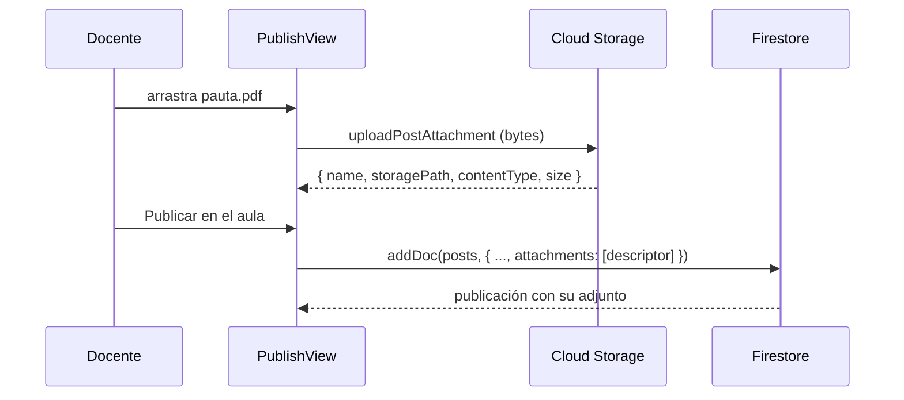

## Context

El portal de CEOUBB es una SPA cliente. `app/page.tsx` monta `Portal`, y cada vista —`courses`, `course`, `calendar`, `resources`, `teacher`, `admin`, `settings`— es estado de un `navReducer` en `app/portal-types.ts`. No existe enrutado por URL ni sincronización con `history`, y `ClassroomView` recibe el `Course` ya resuelto junto con el `SectionRole` derivado de la proyección de membresías.

Por eso la «página dedicada» del encargo se materializa como una vista a pantalla completa dentro de la pantalla `course`, no como una ruta `/cursos/[id]/publicar`. Una ruta real obligaría a rehacer el arranque de sesión, la resolución de la sección contra Turso y la validación de rol fuera del shell, y al volver perdería el estado del portal. El estudio, en cambio, reutiliza la sesión, el `Course` y los manejadores del aula que ya están en memoria.

## Goals / Non-Goals

**Goals**

- Una sola superficie donde el docente redacta, adjunta y publica.
- La Portada como único lugar donde el estudiante busca contenido del ramo.
- Un editor con los bloques que un documento académico necesita, sin dependencias nuevas.
- Ninguna consulta, listener ni escritura adicional por publicación.

**Non-Goals**

- Enrutado por URL para el portal.
- Migración de publicaciones históricas.
- Un motor de edición de terceros.

## Decisions

### El adjunto pertenece al documento de la publicación

En Firestore un archivo ya era una publicación: `uploadClassroomFile` escribía un documento en `courses/{courseId}/posts` con `storagePath`, y `watchClassroom` lo proyectaba a la vez en `posts` y en `files`. Eso explicaba la duplicación de la interfaz.

La subida del estudio usa `uploadPostAttachment`, que sube los bytes y **no** escribe en Firestore. Los descriptores viajan al `addDoc` de `publishClassroomPost` dentro de `attachments`. El aviso y su pauta se crean juntos o no se crea ninguno.



Esquema del documento, en la colección existente:

```ts
type ClassroomAttachment = {
  name: string;
  storagePath: string;
  contentType: string;
  size: number;
};

// posts/{postId}
{
  title: string;
  body: string;
  kind: "notice" | "guide" | "assessment" | "resource";
  folder: string;
  dueDate: string;
  notifyStudents: boolean;
  attachments: ClassroomAttachment[]; // nuevo, techo de 6
}
```

`toAttachments` descarta entradas sin `storagePath`, normaliza tamaños inválidos a `0` y recorta a `MAX_POST_ATTACHMENTS`. Un documento histórico sin el campo devuelve lista vacía, así que no hay migración. Las reglas de Firestore no enumeran campos de `posts`, de modo que el control de escritura sigue siendo el mismo `managesSectionContent(courseId)`.

### El gesto atrás de Android atiende primero a la vista anidada

`useHardwareBack` registra un único listener y una segunda llamada crearía dos suscripciones vivas, retrocediendo dos niveles por pulsación. El estudio, por tanto, no registra su propio manejador: publica `data-hardware-back` en su botón de salida y `handleHardwareBack` en `usePortalCore` lo activa antes de abandonar la pantalla, con el mismo patrón que ya usaba para cerrar un `dialog[open]`.

### El separador y el callout se reconocen en un solo sitio

`parseRichText` gana el bloque `divider` y `startsBlock` lo declara, de modo que un `---` corta el párrafo en curso en vez de quedar dentro de él. La fila de alineación de una tabla se sigue detectando antes, así que `| --- |` continúa siendo tabla.

El callout ya viajaba como cita con marcador `[!NOTE]`, pero sólo el editor lo interpretaba: la publicación publicada mostraba el marcador crudo. `calloutFromQuote` vive ahora en `lib/rich-text.ts` y la consumen tanto `RichText` como `markdownToEditorHtml`.

### El borrador es local y está acotado por sección

`localStorage` bajo `ceoubb_publication_draft:{sectionId}`. Sin red, sin escritura por estudiante y sin fuga entre ramos. Las funciones son puras sobre una interfaz de almacenamiento, de modo que la prueba las ejercita sin navegador, y toda lectura degrada a valores seguros ante JSON corrupto o almacenamiento bloqueado.

### El editor se extiende, no se reemplaza

Añadir ProseMirror o TipTap exigiría autorización de dependencia y una segunda representación del contenido. `MultimodalEditor` ya cubría negrita, cursiva, alineación, tabla, fórmula, código, callout y enlace sobre `contentEditable`, con conversión bidireccional a Markdown académico. Los bloques nuevos son `formatBlock` y `insertUnorderedList` / `insertOrderedList` sobre el mismo mecanismo. El menú `/` reutiliza `applyTool`: no introduce una segunda ruta de inserción.

## Risks / Trade-offs

- **`document.execCommand` está obsoleto.** Ya era la base del editor; los bloques nuevos no amplían la superficie de riesgo. Sustituirlo es un trabajo propio, no un efecto colateral de este cambio.
- **Techo de seis adjuntos.** Acota el tamaño del documento de Firestore. Si un ramo necesita más, la salida es una subcolección, no subir el techo.
- **La Portada crece.** Absorbe las filas que estaban en «Materiales». Se mitiga con el buscador que se muda desde esa pestaña y con `content-visibility: auto` sobre `.post-list article`, que ya protegía la lista.
- **El estudio no tiene URL propia.** Recargar el navegador vuelve al área personal. El borrador local evita que eso cueste el texto escrito.

## Blast radius

| Archivo                                         | Cambio                                                                                            |
| ----------------------------------------------- | ------------------------------------------------------------------------------------------------- |
| `lib/rich-text.ts`                              | bloque `divider`, `isDividerLine`, `calloutFromQuote`, `inlineToPlainText`                        |
| `lib/multimodal-editor.ts`                      | round-trip de `<hr>`, callout compartido, `SLASH_COMMANDS`, `slashQueryBefore`                    |
| `lib/publication-workflow.ts`                   | plantillas, borrador local, estadísticas de lectura                                               |
| `lib/firebase/mappers.ts`                       | `ClassroomAttachment`, `toAttachments`, `MAX_POST_ATTACHMENTS`                                    |
| `lib/firebase/posts.ts`                         | `attachments` en `publishClassroomPost`                                                           |
| `lib/firebase/storage.ts`                       | `uploadPostAttachment`                                                                            |
| `app/views/classroom/PublishView.tsx`           | nuevo                                                                                             |
| `app/views/classroom/ClassroomView.tsx`         | acciones en el encabezado, estado `composing`                                                     |
| `app/views/classroom/PostsSection.tsx`          | adjuntos, buscador, carpeta                                                                       |
| `app/views/classroom/classroom-utils.ts`        | pestañas sin `materials`, `filterPostsByQuery`                                                    |
| `app/views/classroom/use-classroom-handlers.ts` | `openAttachment`, publicación con adjuntos                                                        |
| `app/views/classroom/MultimodalEditor.tsx`      | bloques nuevos y menú de comandos                                                                 |
| `app/views/classroom/RichText.tsx`              | separador y callout renderizados                                                                  |
| `app/usePortalCore.tsx`                         | gesto atrás hacia la vista anidada                                                                |
| `app/globals.css`, `app/mobile-shell.css`       | estilos del estudio; retiro del CSS de materiales y diálogos                                      |
| eliminados                                      | `MaterialsSection`, `PublicationLauncher`, `PublicationWizardDialog`, `PublicationComposerDialog` |

## Migration Plan

Ninguna. El campo `attachments` es aditivo, los documentos sin él se leen como lista vacía, y un archivo antiguo con `storagePath` se sigue ofreciendo como adjunto descargable dentro de su propia publicación en la Portada.
