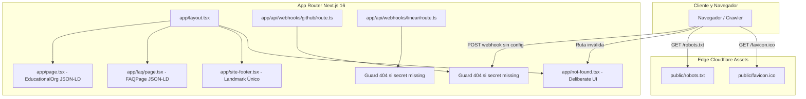

# Diseño Técnico: Remediación Integral de Calidad y Estándares en Producción

## Context

Véase `proposal.md` para la justificación de los hallazgos en producción detectados en `https://ceoubb.com`.
El sistema corre sobre Cloudflare Workers vía OpenNext, con arquitectura de componentes Next.js 16 (App Router), estilos en Tailwind CSS v4 con tokens OKLCH de `DESIGN.md`, gobernanza estricta en `AGENTS.md` y normas de diseño anti-slop.

## Goals / Non-Goals

**Goals:**

- Proporcionar una pantalla 404 institucional (`app/not-found.tsx`) con diseño deliberado (`/deliberate`) e impecable (`/impeccable`), en español, tipografía `Merriweather` + `Manrope`, tokens OKLCH y accesibilidad total (WCAG 2.2 AA).
- Servir un recurso `favicon.ico` válido en la raíz `public/` para detener el desperdicio de transferencia (15 KB por petición) y eliminar errores 404 en navegadores.
- Blindar los endpoints de webhooks (`/api/webhooks/github`, `/api/webhooks/linear`) respondiendo `HTTP 404` cuando el secreto no esté aprovisionado en variables de entorno, evitando fuga de configuración interna y bucles de reintento.
- Ajustar `public/robots.txt` a URL absoluta canónica cumpliendo RFC 9309 (`Sitemap: https://ceoubb.com/sitemap.xml`).
- Resolver la duplicación de landmarks de navegación entre el pie de página (`app/site-footer.tsx`) y las páginas de políticas institucionales.
- Inyectar metadatos canónicos globales en `app/layout.tsx` y datos estructurados Schema.org JSON-LD en `/` (`EducationalOrganization`) y `/faq` (`FAQPage`).
- Optimizar la precarga tipográfica para no forzar la descarga de `JetBrains Mono` en páginas donde no se utilice.

**Non-Goals:**

- No incluye modificaciones ni mantenimiento sobre `/biblioteca/` ni `/biblioteca/index.html` (funcionalidad sujeta a rediseño y desacople futuro).
- No altera esquemas relacionales de Turso/Drizzle ni reglas de seguridad de Firestore.
- No modifica la lógica de autenticación determinista en `lib/access-policy.ts`.

## Decisions

### 1. Marco de Diseño UI/UX para `app/not-found.tsx`: Protocolos `/deliberate` y `/impeccable`

Para evitar cualquier estética genérica o "AI slop" en la nueva interfaz 404, se adopta la hoja de decisiones explícita de `/deliberate` y el modo `Operate` de `/impeccable`:

```
SUBJECT:   Página de error 404 institucional para reorientar a estudiantes o docentes extraviados hacia el portal principal.
GROUND:    Superficie institucional cálida (tokens OKLCH bg-surface-base / bg-surface-raised), evitando negros puros (bg-black, bg-zinc-950).
PALETTE:   OKLCH calibrado de DESIGN.md:
           - Fondo base: bg-surface-base
           - Superficie de tarjeta: bg-surface-raised
           - Texto principal: text-surface-foreground (luminancia calibrada)
           - Borde sutil: border-surface-border (micro-border 1px, sin sombras difusas masivas)
           - Acento: Azul institucional UBB (acento discreto)
TYPE:      Titular y código de estado ("404") en Merriweather (serif editorial institucional).
           Cuerpo explicativo y botón de acción en Manrope (sans-serif moderna y legible).
SPACE:     Rhythm de sección espacioso (min-h-[70vh] flex items-center justify-center p-6), espaciado interno estricto (gap-4, p-8).
SHAPE:     Radio canónico rounded-2xl, micro-border perimetral border-surface-border.
MOTION:    Envoltura obligatoria con useReducedMotion(). Animación sutil de entrada (opacity y translateY <= 8px, física de muelle crítico stiffness: 340, damping: 28), 0ms en reducción de movimiento.
SIGNATURE: Composición sobria con isotipo institucional de CEOUBB, mensaje empático en español ("Página no encontrada") y botón accesible con icono Phosphor ArrowLeft hacia "/".
```

### 2. Tratamiento de Webhooks ante Secretos No Configurados

- **Decisión:** En `app/api/webhooks/github/route.ts` y `app/api/webhooks/linear/route.ts`, si `!process.env.GITHUB_WEBHOOK_SECRET` o `!process.env.LINEAR_WEBHOOK_SECRET`, se devuelve `new Response(null, { status: 404 })`.
- **Alternativas consideradas:**
  - _Mantener status 500:_ Descartado. Le revela a escáneres externos que el endpoint existe pero carece de clave, y causa que GitHub/Linear disparen reintentos con backoff que saturan los logs de error de Cloudflare.
  - _Devolver status 401:_ Descartado para el caso de ausencia de configuración en el servidor, ya que 401 indica credencial de cliente inválida. 404 oculta efectivamente el servicio no implementado o inactivo.

### 3. Solución de Favicon Raíz

- **Decisión:** Incorporar `public/favicon.ico` con el isotipo de CEOUBB en formato multirresolución (16x16 y 32x32) directamente en el directorio público de Cloudflare Assets.
- **Impacto:** Cloudflare Assets entrega el archivo estático en ~20ms con HTTP 200 y tamaño ínfimo (<5 KB), cesando de inmediato las peticiones fallidas que ejecutaban la función SSR de Next.js generando respuestas de 15.6 KB.

### 4. Directiva RFC 9309 en `robots.txt`

- **Decisión:** Actualizar `public/robots.txt` para especificar `Sitemap: https://ceoubb.com/sitemap.xml`.
- **Justificación:** El estándar RFC 9309 exige expresamente URLs absolutas incluyendo protocolo y dominio.

### 5. Desambiguación de Landmarks Accesibles (WCAG 2.1 SC 1.3.1)

- **Decisión:** En `app/site-footer.tsx`, cambiar `aria-label="Documentos relacionados"` por `aria-label="Documentos institucionales y legales"`.
- **Justificación:** En las páginas `/faq`, `/contacto`, `/privacidad`, etc., existe ya una barra de navegación interna con etiqueta "Documentos relacionados". La duplicación causa fallos en Axe-Core y confunde a usuarios de lectores de pantalla.

### 6. Metadatos Canónicos y Datos Estructurados JSON-LD

- **Decisión:**
  - En `app/layout.tsx`: agregar `metadataBase: new URL('https://ceoubb.com')` y alternancia de fuentes.
  - En `app/page.tsx`: inyectar script JSON-LD de `EducationalOrganization`.
  - En `app/faq/page.tsx`: inyectar script JSON-LD de `FAQPage` estructurando las preguntas frecuentes.

## Diagrama de Arquitectura y Blast Radius



## Risks / Trade-offs

- **[Riesgo]** Cacheo prolongado de `robots.txt` en rastreadores de búsqueda:
  - _Mitigación:_ Cloudflare respeta cabeceras de revalidación; la corrección a URL absoluta es 100% retrocompatible y los bots actualizarán el índice en el siguiente barrido.
- **[Riesgo]** Webhooks existentes de prueba que esperaran 500:
  - _Mitigación:_ Los webhooks oficiales de GitHub/Linear esperan 200/204; un 404 detiene limpiamente reintentos innecesarios cuando no hay integración activa.
