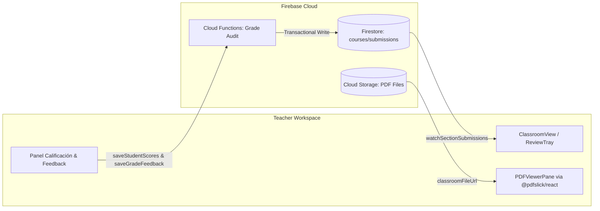

## Context

Ver `proposal.md` y `specs/classroom/submission-review/spec.md`.
El aula virtual de CEOUBB (`ClassroomView`) maneja en tiempo real publicaciones, notas y participantes. Actualmente las calificaciones oficiales se guardan mediante Cloud Functions auditadas (`saveStudentScores`, `saveGradeFeedback`), y los estudiantes cargan sus entregas en Firebase Storage (`courses/${courseId}/submissions/${evalId}/${userId}/...`) registrando un comprobante en Firestore (`courses/${courseId}/submissions/${evalId}_${uid}`). Las reglas de Firestore y Storage ya autorizan la lectura completa para docentes (`teachesSection(courseId)`). El espacio prototipo `/preview/docente/` demostró la viabilidad de la cola de entregas y el panel lateral.

## Goals / Non-Goals

**Goals:**

- Integrar `@pdfslick/react` mediante carga diferida (`next/dynamic`, `ssr: false`) compatible con Web moderna y Capacitor WebView.
- Habilitar una función de escucha en tiempo real para docentes (`watchSectionSubmissions`) en `lib/firebase/storage.ts`.
- Brindar un panel de corrección contextual con calificación (1.0–7.0) y retroalimentación privada con autoguardado reactivo (debounce).
- Incorporar navegación ágil por teclado (anterior / siguiente) ignorada cuando el foco esté en campos editables.
- Permitir consulta contextual de pautas de evaluación asociadas.

**Non-Goals:**

- Anotaciones gráficas o dibujo manual con lápiz sobre el PDF (fuera del alcance de CEO-78; solo visualización de lectura fluida).
- Calificación automatizada por IA o detección de plagio.
- Modificación de las reglas de seguridad de Firestore/Storage (las reglas vigentes ya son suficientes).

## Decisions

### 1. Carga Dinámica Aislada de PDFSlick

- **Decisión**: Encapsular `@pdfslick/react` en un subcomponente cliente (`PDFViewerPane.tsx`) e importarlo dinámicamente con `{ ssr: false }`.
- **Razón**: PDF.js depende de objetos globales del navegador (`window`, `document`, Canvas y Web Worker). El renderizado del lado del servidor provocaría fallos de hidratación.
- **Alternativa descartada**: Visores `<iframe>` nativos del navegador, descartados porque en móviles y Capacitor WebView descargan el archivo en lugar de visualizarlo dentro de la app.

### 2. Patrón de Integración en `ClassroomView`

- **Decisión**: La bandeja de corrección se expone a docentes desde el encabezado o la sección de notas, pudiendo montarse en modo pantalla completa (análogo a `PublishView`) o como mesa de trabajo integrada, dando total libertad a la implementación para la ergonomía visual.
- **Razón**: Permite concentrarse en la lectura y evaluación sin distracciones ni saltos de interfaz.

### 3. Persistencia Reactiva y Debounce

- **Decisión**:
  - La nota numérica se valida en `[1.0, 7.0]` y se persiste en `blur` o tras validación completa vía `saveStudentScores`.
  - La retroalimentación de texto libre se guarda con debounce (600–800 ms) o al cambiar de alumno mediante `saveGradeFeedback`.
  - Estados visuales claros: "Guardado", "Guardando...", o indicador de error.
- **Razón**: Evita saturar la Cloud Function auditada en cada pulsación de tecla mientras previene la pérdida de datos si el docente navega rápidamente entre alumnos.

### 4. Atajos de Teclado con Supresión Contextual

- **Decisión**: `useKeyDown` escucha eventos en el contenedor principal pero se desactiva incondicionalmente si `document.activeElement` es un `HTMLInputElement` o `HTMLTextAreaElement`.
- **Razón**: Garantiza accesibilidad WCAG 2.2 y previene saltos accidentales de alumno mientras el docente redacta comentarios.

## Data Flow & Architecture

## Risks / Trade-offs

- **[Riesgo: Compatibilidad de PDF.js Worker en Next.js 16]** → **Mitigación**: `@pdfslick/react` maneja internamente el worker o permite especificar worker local. Si Next.js emite advertencia de worker, se sirve desde `public/` o se usa la configuración embebida de PDFSlick.
- **[Riesgo: Consumo de memoria en WebView móvil al paginar muchos PDFs pesados]** → **Mitigación**: Desmontar adecuadamente las instancias del visor al cambiar de entrega y destruir objetos URL blob creados.
