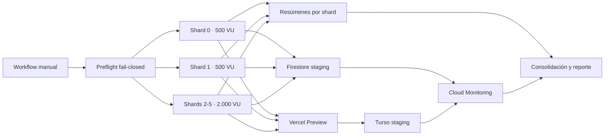

# Diseño técnico: Arnés distribuido de capacidad institucional

## Contexto y decisión

La aplicación combina HTML y rutas API en Vercel, sesiones y catálogo en Turso, y datos operacionales en Firestore. Un único tipo de petición ocultaría cuellos de botella. El arnés usa seis runners independientes con segmentos k6 equivalentes; cada shard prepara 2.000 estudiantes, 500 secciones, 12.000 matrículas y 500 identidades activas. La suma conserva exactamente la envolvente institucional y evita depender de un coordinador central de k6.



## Contratos

### Manifest de ejecución

```ts
type CapacityRunManifest = {
  runId: string;
  targetUrl: "https://ceoubb-staging.vercel.app";
  firebaseProjectId: "centro-de-estudio-ubb-staging";
  tursoDatabaseUrl: string;
  shards: 6;
  virtualUsersPerShard: 500;
  rampDuration: "10m";
  steadyDuration: "30m";
  activeStudents: 12000;
  sections: 3000;
  enrollments: 72000;
};
```

### Resultado consolidado

```ts
type CapacityEvidence = {
  runId: string;
  startedAt: string;
  finishedAt: string;
  executedShards: number;
  peakVirtualUsers: number;
  steadyStateSeconds: number;
  httpP95Ms: number | null;
  httpP99Ms: number | null;
  http5xxRate: number | null;
  unexpectedResponseRate: number | null;
  authorizationErrors: number;
  firestoreReads: number | null;
  firestoreWrites: number | null;
  tursoRequests: number;
  tursoP95Ms: number | null;
  annualClpPerStudent: number | null;
  verdict: "PASS" | "FAIL" | "INCOMPLETE";
};
```

## Secuencia de autenticación y carga

1. Cada shard obtiene credenciales OIDC efímeras del service account exclusivo de staging.
2. El preparador converge usuarios Firebase/Turso, secciones, matrículas, avisos, notas, certámenes y borradores sintéticos de su rango.
3. El preparador emite localmente credenciales Firebase de una hora para 500 estudiantes activos; no las publica como artefactos.
4. Cada VU intercambia su credencial, crea su cookie de sesión mediante `/api/auth/firebase` y ejecuta navegación, catálogo y datos Firestore con su propia identidad.
5. El 10% determinista de las iteraciones actualiza únicamente el borrador sintético del propio estudiante.
6. Al terminar, el shard revoca su bypass Vercel y elimina el archivo local de credenciales; los datos sintéticos permanecen idempotentes para repetir la medición.

## Métricas y costo

| Fuente       | Medición                                     | Estrategia                                                                                                     |
| :----------- | :------------------------------------------- | :------------------------------------------------------------------------------------------------------------- |
| k6           | p95, p99, 5xx, autorizaciones, VU y duración | JSON por shard; sumas para conteos y máximo conservador entre shards para percentiles                          |
| Firestore    | lecturas y escrituras exitosas               | Cloud Monitoring `document/read_count` y `document/write_count`, esperando la ventana de ingestión             |
| Turso        | peticiones y latencia directa/API            | tags k6 separados; la API oficial de usage agrega filas leídas/escritas sólo cuando existe token de plataforma |
| Vercel/Turso | latencia de HTML/API y API Turso             | tags k6 separados para navegador, rutas Turso y Firestore                                                      |
| Costo        | CLP por estudiante-año                       | precios versionados del baseline, contadores medidos y supuestos explícitos de ventanas académicas             |

## Seguridad y presupuestos

- El preflight MUST rechazar cualquier host que no sea `ceoubb-staging.vercel.app`, cualquier Firebase distinto de `centro-de-estudio-ubb-staging` y cualquier Turso cuyo host no contenga `ceoubb-staging`.
- Los bypasses de Vercel se generan por shard, sólo viven durante la ejecución y se revocan en `always()`.
- Los tokens Firebase y Turso nunca se incluyen en logs, resúmenes ni artefactos.
- La escritura se limita al 10% de iteraciones y al borrador propio; no se relajan reglas.
- El arnés descarta cuerpos no necesarios y usa consultas limitadas para mantener memoria y costos acotados.
- Gate: p95 <= 2.000 ms, p99 <= 4.000 ms, HTTP 5xx < 0,1%, respuestas HTTP o de transporte inesperadas < 0,1%, cero autorizaciones incorrectas, 3.000 VU y 1.800 segundos de meseta.

## Taxonomía de errores

| Código                       | Condición                         | Resultado                  | Reintento                |
| :--------------------------- | :-------------------------------- | :------------------------- | :----------------------- |
| `CAPACITY_TARGET_REJECTED`   | destino no canónico o producción  | abortar antes de escribir  | no                       |
| `CAPACITY_CONFIG_INCOMPLETE` | falta credencial o variable       | `INCOMPLETE`               | sí, tras configurar      |
| `CAPACITY_FIXTURE_FAILED`    | no converge el dataset            | `FAIL`                     | sí, idempotente          |
| `CAPACITY_AUTH_FAILED`       | no se crean sesiones individuales | `FAIL`                     | sí, tras IAM/Auth        |
| `CAPACITY_TELEMETRY_MISSING` | proveedor no entrega contador     | `INCOMPLETE`, nunca `PASS` | sí                       |
| `CAPACITY_THRESHOLD_FAILED`  | SLO excedido                      | `FAIL`                     | repetir sin reducir meta |

## Blast radius e invariantes

- No se altera `lib/access-policy.ts`; los usuarios de carga usan correos sintéticos del dominio estudiantil y cuentas verificadas sólo en Firebase staging.
- No se altera `lib/grades.ts`; las notas son fixtures de lectura.
- No se modifica el sembrado ordinario de staging ni sus límites; el proceso institucional vive en archivos separados.
- No se toca producción, Android, biblioteca ni disclaimers.
- La ejecución puede consumir cuotas reales de staging y minutos de Actions; el workflow exige `workflow_dispatch` y `confirm_staging=STAGING_ONLY`.

## TDD

- RED: las pruebas rechazan la ausencia de módulos, manifiestos, guards, escenarios y agregador.
- GREEN: se implementa el mínimo arnés que satisface los contratos y fixtures deterministas.
- REFACTOR: se extraen funciones puras de validación, agregación y costo manteniendo hashes de pruebas.
