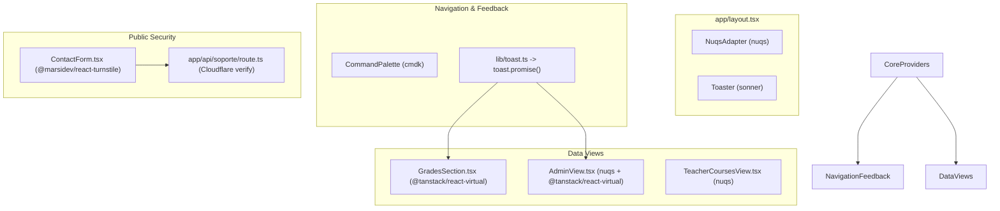

## Context

Ver `proposal.md` y las especificaciones en `specs/**/*.md`.
CEOUBB es una aplicación web y móvil híbrida Next.js 16 (React 19) alojada en Cloudflare Workers y compilada en móvil mediante Capacitor 7 Runtime. Actualmente la comunicación de feedback efímero (`note`) es local y no estandarizada, los estados de búsqueda y paginación en `AdminView` o `TeacherCoursesView` son puramente volátiles en memoria sin soporte de URL search params ni sincronización con el historial del navegador, el buscador `command-palette.tsx` fue ensamblado artesanalmente con listas planas y algoritmos ad-hoc, las tablas de actas de notas renderizan cientos de nodos DOM simultáneos provocando caídas de FPS en laptops y móviles institucionales modestos, y la protección antibot en el formulario de contacto inyecta scripts de forma manual al DOM.

## Goals / Non-Goals

**Goals:**

- Integrar un sistema de notificaciones flotantes institucional accesible, táctil y reactivo con `sonner` soportando `toast.promise` para guardado de calificaciones y subida de archivos.
- Incorporar sincronización bidireccional y tipo-segura de estado en URL con `nuqs` para filtros, pestañas y paginación en vistas clave (`AdminView`, `TeacherCoursesView`, `CoursesDashboard`).
- Modernizar la paleta de comandos global (`Ctrl+K`) integrando la librería headless `cmdk` con estilizado OKLCH deliberado, preservando física de resortes y navegación por teclado.
- Asegurar 60 FPS en nóminas masivas de estudiantes y actas mediante virtualización de filas con `@tanstack/react-virtual`.
- Declarar el widget de protección antibot Cloudflare Turnstile de forma robusta y tipada con `@marsidev/react-turnstile` en `/contacto`.

**Non-Goals:**

- No alterar las reglas de seguridad de Firestore (`firestore.rules`) ni de Storage (`storage.rules`).
- No modificar el cálculo ni el redondeo de calificaciones de la escala chilena en `lib/grades.ts`.
- No alterar la derivación de roles determinista por dominio en `lib/access-policy.ts`.
- No implementar persistencia de estado de filtros en base de datos; la URL es el único estado compartido para filtros.

## Decisions

### 1. Proveedor Global de Toasts con Sonner y Tokens OKLCH

- **Decisión**: Montar `<Toaster />` en `app/layout.tsx` con estilos adaptados al sistema de diseño de CEOUBB, mapeando colores mediante variables OKLCH (`--surface-raised`, `--border-surface`, `--color-primary`) y reemplazando o proveyendo un puente tipado `lib/toast.ts` para interoperar con el patrón previo `note(text, tone)`.
- **Razón**: `sonner` es la solución canónica en React 19 / Next.js; maneja naturalmente promesas (`toast.promise`), apilamiento tridimensional, swipe-to-dismiss en móviles y respeta `prefers-reduced-motion`.
- **Alternativa considerada**: `react-hot-toast` (incompatible o con fricción en React 19) o alertas fijas en el DOM (toscas y desincronizadas con la vista).

### 2. Sincronización de Parámetros en URL con `nuqs`

- **Decisión**: Envolver la aplicación con `<NuqsAdapter>` en `app/layout.tsx` y definir esquemas de validación Zod reutilizables en `lib/search-params.ts`. Consumir en componentes cliente mediante `useQueryState` con opciones `shallow: true` y `history: "push" | "replace"`.
- **Razón**: Permite compartir enlaces con filtros específicos (ej. período académico, alumno buscado, pestaña activa) y restaura el estado instantáneamente al usar el botón Atrás/Adelante del navegador sin recargar el servidor.
- **Alternativa considerada**: Manejo manual con `useRouter` y `useSearchParams` de Next.js, descartado por requerir decenas de líneas de código repetitivo y riesgo de bucles de re-renderizado.

### 3. Migración de `CommandPalette` a Primitiva Headless `cmdk`

- **Decisión**: Refactorizar la capa interna de `app/command-palette.tsx` utilizando `<Command.Dialog>`, `<Command.Input>`, `<Command.List>`, `<Command.Group>` y `<Command.Item>` de `cmdk`, preservando el wrapper modal con `motion/react` y los iconos `@phosphor-icons/react`.
- **Razón**: `cmdk` maneja de forma impecable el filtrado difuso interno, la gestión de foco ARIA (accesibilidad WCAG 2.2 AA), la selección activa con `aria-selected` y el soporte de teclado (`ArrowDown`, `ArrowUp`, `Enter`, `Escape`), eliminando más de 150 líneas de lógica de cursor manual frágil.
- **Alternativa considerada**: Mantener el hook casero `useRowCursor`, descartado por inconsistencias en navegación cíclica y soporte deficiente para lectores de pantalla.

### 4. Virtualización de Filas con `@tanstack/react-virtual`

- **Decisión**: Implementar un contenedor virtualizado en `GradesSection.tsx` y `AdminView.tsx` utilizando `useVirtualizer({ count, getScrollElement, estimateSize: () => 52, overscan: 5 })`.
- **Razón**: En cursos masivos (>100 estudiantes) o en el directorio administrativo (>5.000 usuarios), el renderizado plano colapsa la memoria en dispositivos de gama de entrada. La virtualización mantiene un número acotado de nodos DOM (<40 elementos), garantizando 60 FPS estables.
- **Alternativa considerada**: Paginación tradicional estricta; sin embargo, para docentes que ingresan notas en serie, la paginación introduce fricción cognitiva indeseada. La virtualización permite un scroll infinito continuo con el rendimiento de la paginación.

### 5. Integración Declarativa de Cloudflare Turnstile con `@marsidev/react-turnstile`

- **Decisión**: Reemplazar la inyección dinámica de `<script>` en `app/contacto/useTurnstile.ts` por el componente `<Turnstile />` de `@marsidev/react-turnstile` en `app/contacto/ContactForm.tsx`.
- **Razón**: Maneja el ciclo de vida de React, soporte de tema `auto` (claro/oscuro), regeneración automática de tokens caducados (`onExpire`) y recuperación de errores sin contaminar el objeto global `window`. El backend en `app/api/soporte/route.ts` ya valida el token contra Cloudflare y no requiere modificaciones.
- **Alternativa considerada**: Continuar con script manual, descartado por fragilidad ante navegaciones SPA y falta de manejo tipado de reintentos.

## Blast Radius & Component Architecture



### Affected Files (Blast Radius Analysis)

| Archivo                                 | Acción                 | Impacto / Responsabilidad                                                                                  |
| :-------------------------------------- | :--------------------- | :--------------------------------------------------------------------------------------------------------- |
| `package.json`                          | MODIFICAR              | Adición de dependencias: `sonner`, `nuqs`, `cmdk`, `@tanstack/react-virtual`, `@marsidev/react-turnstile`. |
| `app/layout.tsx`                        | MODIFICAR              | Montaje de `<NuqsAdapter>` y `<Toaster />` con configuración de diseño deliberado OKLCH.                   |
| `lib/toast.ts`                          | NUEVO                  | Helper institucional tipado que encapsula `toast` de Sonner con iconos y temas de CEOUBB.                  |
| `lib/search-params.ts`                  | NUEVO                  | Definición de parsers y esquemas Zod para parámetros URL (`q`, `page`, `tab`, `periodo`, `filtro`).        |
| `app/command-palette.tsx`               | MODIFICAR              | Sustitución de lista y cursor artesanal por primitivas de `cmdk`.                                          |
| `app/views/classroom/GradesSection.tsx` | MODIFICAR              | Integración de `useVirtualizer` para scroll masivo de alumnos y `toast.promise` para guardado de notas.    |
| `app/views/AdminView.tsx`               | MODIFICAR              | Sincronización de búsqueda/página en URL (`nuqs`) y virtualización de tabla de usuarios.                   |
| `app/views/TeacherCoursesView.tsx`      | MODIFICAR              | Sincronización de pestañas activas (`tab`) en URL search params.                                           |
| `app/contacto/ContactForm.tsx`          | MODIFICAR              | Sustitución de hook imperativo por componente `<Turnstile />`.                                             |
| `app/contacto/useTurnstile.ts`          | ELIMINAR/OBSOLESCENCIA | Reemplazado integralmente por la librería oficial.                                                         |
| `tests/modern-stack.test.ts`            | NUEVO                  | Suite de pruebas unitarias verificando inicialización, parsers de URL y compatibilidad de componentes.     |

## Zod & Parameter Schemas

```typescript
// lib/search-params.ts
import { parseAsInteger, parseAsString, parseAsStringLiteral } from "nuqs";
import { z } from "zod";

export const adminSearchParamsSchema = {
  q: parseAsString.withDefault(""),
  page: parseAsInteger.withDefault(1),
};

export const teacherCoursesTabSchema = {
  tab: parseAsStringLiteral(["data", "evaluations", "assistants"] as const).withDefault("data"),
};

export const coursesFilterSchema = {
  periodo: parseAsString.withDefault(""),
  carrera: parseAsString.withDefault(""),
  estado: parseAsStringLiteral(["todos", "activo", "archivado"] as const).withDefault("todos"),
};
```

## Impeccable & Deliberate UI Specifications

Siguiendo las directivas de `/impeccable` y `/deliberate`:

1. **Ground y Superficies**:
   - Toasts y paleta de comandos renderizan sobre `bg-surface-raised` (`oklch(1 0 0)` / `oklch(0.24 0.02 260)` en oscuro) con micro-bordes `border-[oklch(0.92_0.006_60)]` y sombras sutiles acotadas. Cero resplandores de neón genéricos (`blur-3xl`, `violet-*`).
2. **Iconografía Institucional**:
   - Uso exclusivo de `@phosphor-icons/react` en toasts (`CheckCircle`, `WarningCircle`, `Info`, `SpinnerGap`) y en `cmdk` (`Books`, `GraduationCap`, `MagnifyingGlass`, `X`).
3. **Física de Movimiento y Accesibilidad**:
   - Animación de `cmdk` con resortes críticamente amortiguados (`stiffness: 560, damping: 40`).
   - Atajo de escape inmediato (`0ms`) por teclado.
   - En presencia de `prefers-reduced-motion`, desactivación total de escalas y rebotes elásticos (`duration: 0.1s`, desvanecimiento simple).
4. **Numerales Tabulares**:
   - Aplicación estricta de `font-variant-numeric: tabular-nums lining-nums` en notas, contadores de filas y atajos de teclado (`<kbd>`).

## Risks / Trade-offs

- **[Riesgo: Hidratación de URL en SSR con Next.js 16 App Router]** → **Mitigación**: `nuqs` requiere `<NuqsAdapter>` en el layout raíz para gestionar la sincronización asíncrona de `useSearchParams` sin provocar caídas de Suspense en build o renderizado en el servidor.
- **[Riesgo: Cálculos de altura en virtualizador si los nombres o comentarios de estudiantes tienen alturas dinámicas]** → **Mitigación**: Configurar `estimateSize` con medición dinámica (`measureElement`) provista de forma nativa por `@tanstack/react-virtual`.
- **[Riesgo: Bloqueo de Turnstile en entornos de desarrollo local o testing sin conexión]** → **Mitigación**: Mantener la bandera de bypass existente para desarrollo y preview ya soportada en el backend `app/api/soporte/route.ts`.
